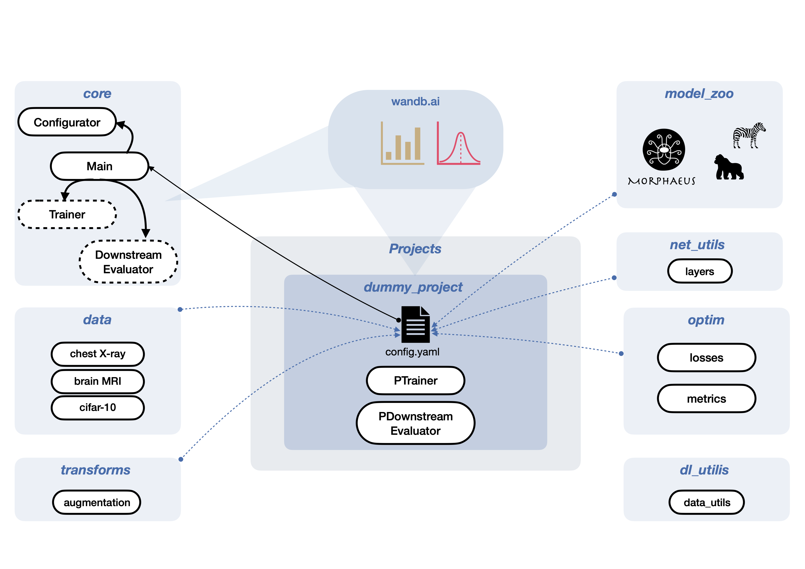

# IML-CompAI DL

Overview Deep Learning Framework




# Installation guide: 

0). Set up wandb. (https://docs.wandb.ai/quickstart)
 *  Sign up for a free account at https://wandb.ai/site and then login to your wandb account.
 * Login to wandb with `wandb login`
 * Paste the API key when prompted. You will find your API key here: https://wandb.ai/authorize. 
 
1). Clone iml-dl to desired location 
 * `git clone https://github.com/iml-compai-munich/iml-dl.git *TARGET_DIR*`

2). Create a virtual environment with the needed packages (use conda_environment-osx.yaml for macOS)
```
cd ${TARGET_DIR}/iml-dl
conda env create -f conda_environment.yaml
source activate iml_py308 *or* conda activate iml_py308
```

3). Install pytorch
* *with cuda*: 
```
pip3 install torch==1.9.1+cu111 torchvision==0.10.1+cu111 -f https://download.pytorch.org/whl/torch_stable.html
```
* *w/o cuda*:
```
pip3 install torch==1.9.1 torchvision==0.10.1 -f https://download.pytorch.org/whl/torch_stable.html
```

4). Run the demo script: 
```
python core/Main.py --config_path projects/dummy_project/config_cifar10.yaml
```


5). _Optional_: Clone the projects folder to your own Github:

```
cd ${TARGET_DIR}/iml-dl/projects
git init
git remote add origin $URL_TO_YOUR_REPO
git branch -M main
git commit -m "first commit"
git push -u origin main
```
# Push policy 
Please create a new branch for your project. Desired changes to the framework can be done on a push-request and code peer-review basis. 

# That's it, enjoy! :rocket:
